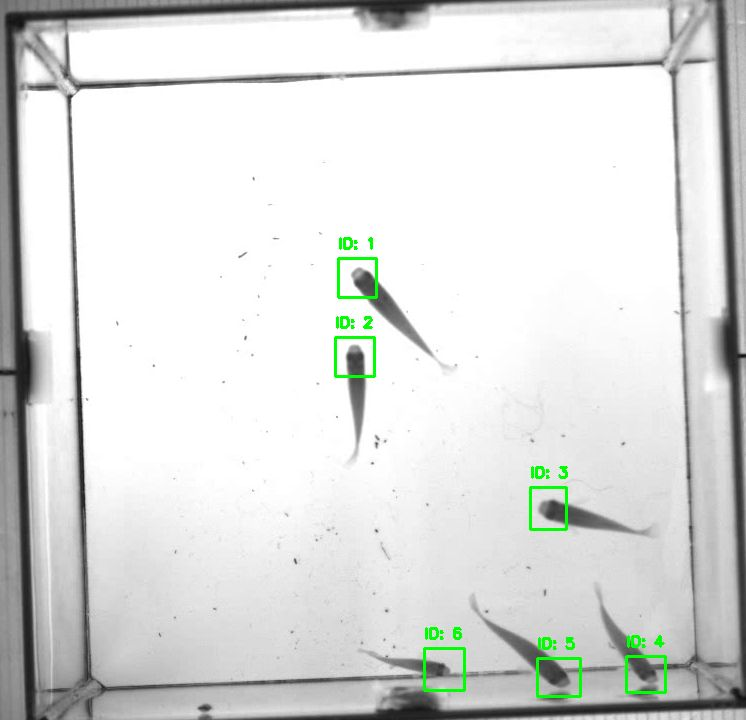

I am a PhD student at the Robotic Interactive Perception lab with [Guillermo Gallego](https://sites.google.com/view/guillermogallego), at [Technical University Berlin](https://www.tu.berlin/en/). Previously, I did my master in electrical engineering at RWTH Aachen.

I am working with event cameras, novel, bio-inspired vision sensors that output pixel-level brightness changes instead of standard intensity frames. My goal is to design algorithms that leverage the properties of event cameras to solve different computer vision tasks. As part of the cluster of excellence ["Science of Intelligence"](https://www.scienceofintelligence.de/) I work with biologists and neuroscientists, to build event-based tools for animal behavior observation.

<!-- News -->
<!-- ====== -->

Publications
======

<table border="0">
  <tr>
    <td>
      
    </td>
    <td>
      <h3>Stereo Co-capture System for Recording and Tracking Fish with Frame-and Event Cameras.</h3>
      <strong>Friedhelm Hamann</strong>, Guillermo Gallego 
      <em>26th Int. Conf. Pattern Recognition (ICPR), Visual observation and analysis workshop, 2022</em> 
      <a href="https://homepages.inf.ed.ac.uk/rbf/VAIB22PAPERS/vaib22fhgg.pdf"> Paper</a>
    </td>
  </tr>
</table>

<!-- Projects -->
<!-- ====== -->
